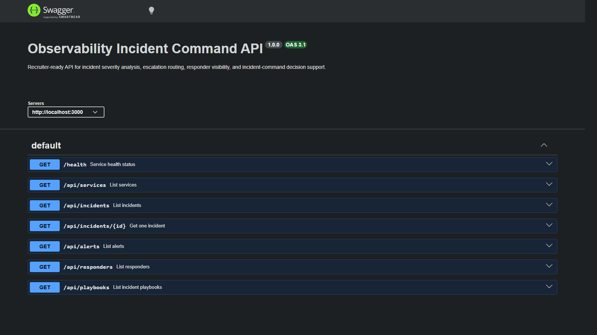
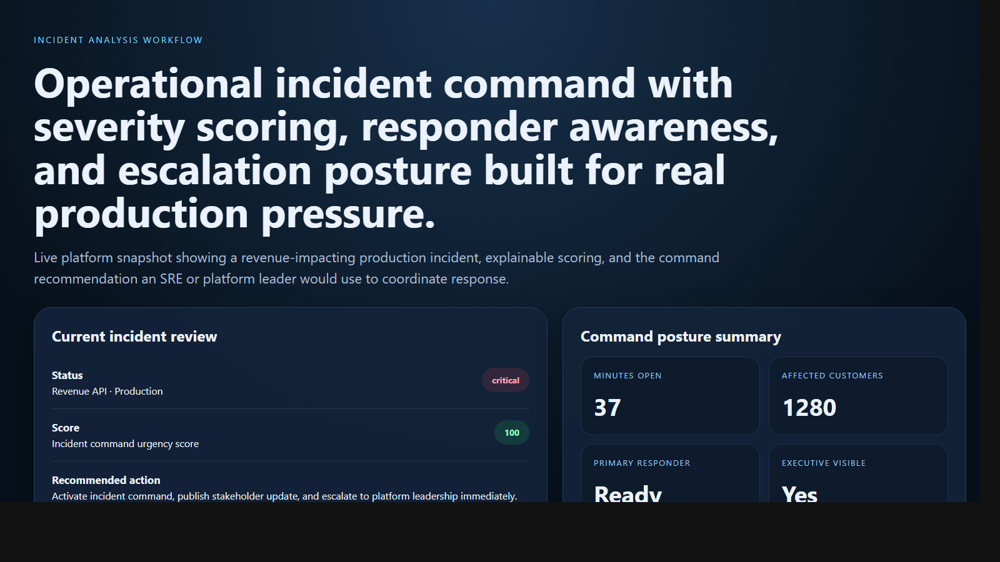
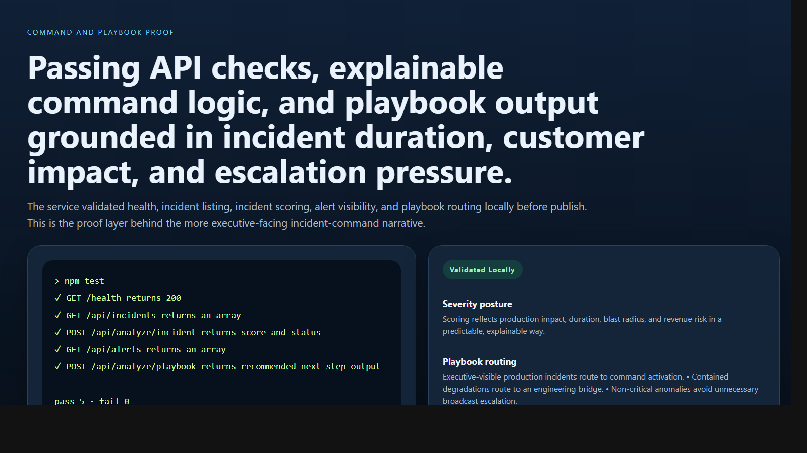

# Observability Incident Command API

> **TypeScript incident-response portfolio project** demonstrating operational severity analysis, escalation routing, service-health visibility, and incident-command decision support for enterprise platforms.

**Recruiter takeaway:** *"This person understands observability as an operational decision system, not just a dashboard feed."*

---

## Project Overview

| Attribute | Detail |
|---|---|
| **Runtime** | Node.js + TypeScript |
| **Framework** | Express 5 |
| **Domain** | Incident response, service reliability, and observability operations |
| **Signal Areas** | Service criticality · Alert signals · Customer impact · Revenue risk · Responder readiness |
| **Operational Outputs** | Severity posture · Escalation analysis · Incident playbooks |
| **Docs** | Swagger UI at `/docs` |

---

## Executive Summary

Observability Incident Command API models the kind of internal system SRE, DevOps, platform engineering, and leadership teams use when production incidents need fast classification and coordinated response. Instead of exposing raw alerts alone, the API turns service criticality, duration, blast radius, revenue impact, and responder availability into clear incident-command actions and communication posture.

The result is a recruiter-facing backend project that feels like a realistic operational command layer rather than a toy alerting demo.

---

## Architecture

```text
Incident signal input
    |
    v
POST /api/analyze/*
    |
    +--> Request validation
    +--> Severity and duration review
    +--> Customer and revenue impact weighting
    +--> Escalation and playbook routing
    |
    v
Operational incident posture
    |
    +--> contained
    +--> degraded
    +--> critical
```

### Incident-Response Workflow

1. Teams submit an incident scenario or query modeled incidents and alerts.
2. The service validates request shape with Zod.
3. Incident scoring logic reviews production impact, duration, customer blast radius, revenue risk, responder availability, and executive visibility.
4. The service returns a score, issues, passed checks, and a recommended next action.
5. Operators use `/api/dashboard/summary`, `/api/alerts`, and `/api/playbooks` to coordinate command and escalation workflows.

---

## Severity and Escalation Model

### Incident Review

The severity workflow scores:

- production vs non-production impact
- open duration
- affected-customer volume
- revenue impact
- responder availability
- executive visibility

### Playbook Routing

Playbook output prioritizes:

- executive-visible incident command activation
- controlled engineering-bridge response
- low-broadcast routing for contained anomalies

---

## API Endpoints

| Method | Endpoint | Purpose |
|---|---|---|
| `GET` | `/health` | Service status and uptime |
| `GET` | `/api/services` | List services |
| `GET` | `/api/incidents` | List incidents |
| `GET` | `/api/incidents/:id` | Fetch one incident |
| `GET` | `/api/alerts` | List alert records |
| `GET` | `/api/responders` | List responder records |
| `GET` | `/api/playbooks` | List incident playbooks |
| `GET` | `/api/dashboard/summary` | Incident-command summary |
| `POST` | `/api/analyze/incident` | Analyze incident severity |
| `POST` | `/api/analyze/escalation` | Analyze escalation posture |
| `POST` | `/api/analyze/playbook` | Route to an incident playbook |

---

## Sample Analysis Request

```json
{
  "serviceName": "Revenue API",
  "environment": "production",
  "severitySignals": [
    "latency-spike",
    "error-rate-breach",
    "customer-login-failures"
  ],
  "minutesOpen": 37,
  "affectedCustomers": 1280,
  "isRevenueImpacting": true,
  "primaryResponderAvailable": true,
  "executiveVisibility": true
}
```

## Sample Analysis Response

```json
{
  "status": "critical",
  "score": 100,
  "issues": [
    "Customer-facing production degradation is ongoing.",
    "Incident duration exceeds first-response containment target.",
    "Large customer impact increases command urgency.",
    "Revenue-impacting symptoms raise escalation priority.",
    "Executive visibility requires structured communication and command discipline."
  ],
  "passedChecks": [
    "Primary responder is available.",
    "Service ownership is clearly defined."
  ],
  "recommendedNextAction": "Activate incident command, publish stakeholder update, and escalate to platform leadership immediately."
}
```

---

## Screenshots

### Hero Capture



### Incident Analysis Workflow



### Command and Playbook Proof



---

## Getting Started

### Prerequisites

- Node.js 20+
- npm

### Setup

```bash
git clone https://github.com/mizcausevic-dev/observability-incident-command-api.git
cd observability-incident-command-api
npm install
cp .env.example .env
npm run dev
```

Visit:

- `http://localhost:3000/docs`
- `http://localhost:3000/api/incidents`
- `http://localhost:3000/api/dashboard/summary`

### Run Tests

```bash
npm test
```

---

## What This Demonstrates

- incident response translated into backend service logic
- severity and escalation modeling under operational pressure
- customer-impact and executive-communication awareness
- observability as a command and coordination layer
- production-minded TypeScript API structure with docs, tests, and operational summaries

---

## Future Enhancements

- persist incidents, responders, and updates in PostgreSQL
- connect alert ingestion from telemetry pipelines
- add structured stakeholder communication workflows
- support on-call rotations and schedule awareness
- integrate postmortem and review lifecycle tracking

---

## Tech Stack

- Node.js
- TypeScript
- Express
- Zod
- Swagger / OpenAPI
- Helmet
- CORS
- Morgan
- Node test runner + Supertest

### Portfolio Links

- [LinkedIn](https://www.linkedin.com/in/mirzacausevic)
- [Skills Page](https://mizcausevic.com/skills/)
- [Medium](https://medium.com/@mizcausevic)
- [GitHub](https://github.com/mizcausevic-dev)

---

*Part of [mizcausevic-dev's GitHub portfolio](https://github.com/mizcausevic-dev) — demonstrating production reliability thinking, incident-response decisioning, and enterprise operational command systems.*
